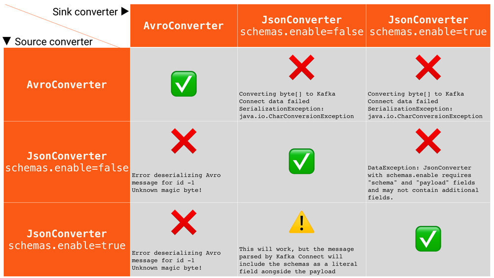

# Kafka Connect for Azure Cosmos DB
[](https://github.com/microsoft/kafka-connect-cosmosdb/blob/dev/README.md) [](https://github.com/microsoft/kafka-connect-cosmosdb/blob/dev/CONTRIBUTING.md) [](https://github.com/microsoft/kafka-connect-cosmosdb/pulse) 

[](https://github.com/microsoft/kafka-connect-cosmosdb/actions?query=workflow%3A%22Java+CI+with+Maven%22) [](https://github.com/microsoft/kafka-connect-cosmosdb/releases)

## Introduction

This project provides connectors for [Kafka Connect](http://kafka.apache.org/documentation.html#connect) to read from and write data to [Azure Cosmos DB](https://azure.microsoft.com/en-us/services/cosmos-db/).

## Supported Data Formats

The sink & source connectors are configurable in order to support:

| Format Name  | Description |
| :----------- | :---------- | 
| JSON (Pain) | JSON record structure without any attached schema. |
| JSON with Schema | JSON record structure with explicit schema information to ensure the data matches the expected format. |
| AVRO | An open source serialization system that provides a compact binary format and a JSON-like API. Integrates with the [Confluent Schema Registry](https://www.confluent.io/confluent-schema-registry) to manage schema definitions. 


Since key and value settings, including the format and serialization, can be independently configured in Kafka, it is possible to work with different data formats for records' keys and values respectively.

To cater for this there is converter configuration for both *key.converter* and *value.converter*.

### Converter Configuration Examples

#### JSON (Plain)
- If you need to use JSON without Schema Registry for Connect data, you can use the JsonConverter supported with Kafka. The example below shows the JsonConverter key and value properties that are added to the configuration:

  ```properties
  key.converter=org.apache.kafka.connect.json.JsonConverter
  key.converter.schemas.enable=false
  value.converter=org.apache.kafka.connect.json.JsonConverter
  value.converter.schemas.enable=false
  ```

#### JSON with Schema

- When the properties `key.converter.schemas.enable` and `value.converter.schemas.enable` are set to true, the key or value is not treated as plain JSON, but rather as a composite JSON object containing both an internal schema and the data.

  ```properties
  key.converter=org.apache.kafka.connect.json.JsonConverter
  key.converter.schemas.enable=true
  value.converter=org.apache.kafka.connect.json.JsonConverter
  value.converter.schemas.enable=true
  ```

- The resulting message to Kafka would look like the example below, with schema and payload top-level elements in the JSON:

  ```json
  {
    "schema": {
      "type": "struct",
      "fields": [
        {
          "type": "int32",
          "optional": false,
          "field": "userid"
        },
        {
          "type": "string",
          "optional": false,
          "field": "name"
        }
      ],
      "optional": false,
      "name": "ksql.users"
    },
    "payload": {
      "userid": 123,
      "name": "user's name"
    }
  }
  ```

> NOTE: The message written is made up of the schema + payload. Notice the size of the message, as well as the proportion of it that is made up of the payload vs. the schema. This is repeated in every message you write to Kafka. In scenarios like this, you may want to use a serialisation format like JSON Schema or Avro, where the schema is stored separately and the message holds just the payload.

#### AVRO
- To use the AvroConverter with [Schema Registry](https://docs.confluent.io/platform/current/schema-registry/connect.html), you specify the `key.converter` and `value.converter` properties in the worker configuration. An additional converter property must also be added that provides the Schema Registry URL. The example below shows the AvroConverter key and value properties that are added to the configuration:

  ```properties
  key.converter=io.confluent.connect.avro.AvroConverter
  key.converter.schema.registry.url=http://schema-registry:8081
  value.converter=io.confluent.connect.avro.AvroConverter
  value.converter.schema.registry.url=http://schema-registry:8081
  ```

### Choosing a conversion format

- If you're configuring a **Source connector** and 
  - If you want Kafka Connect to incldue plain JSON in the message it writes to Kafka, you'd set [JSON (Plain)](#json-plain) configuration.
  - If you want Kafka Connect to include the schema in the message it writes to Kafka, you’d set [JSON with Schema](#json-with-schema) configuration.
  - If you want Kafka Connect to include AVRO format in the message it writes to Kafka, you'd set [AVRO](#avro) configuration.

- If you’re consuming JSON data from a Kafka topic in to a **Sink connector**, you need to understand how the JSON was serialised when it was written to the Kafka topic: 
  - If it was with JSON serialiser, then you need to set Kafka Connect to use the JSON converter `(org.apache.kafka.connect.json.JsonConverter)`.
    - If the JSON data was written as a plain string, then you need to determine if the data includes a nested schema/payload. If it does,then you would set, [JSON with Schema](#json-with-schema) configuration.
    - However, if you’re consuming JSON data and it doesn’t have the schema/payload construct, then you must tell Kafka Connect **not** to look for a schema by setting `schemas.enable=false` as per [JSON (Plain)](#json-plain) configuration.
  - If it was with AVRO serialiser, then you need to set Kafka Connect to use the AVRO converter `(io.confluent.connect.avro.AvroConverter)` as per [AVRO](#avro) configuration.

#### Common Errors

Some of the [common errors](https://www.confluent.io/blog/kafka-connect-deep-dive-converters-serialization-explained/#common-errors) you can get if you misconfigure the converters in Kafka Connect. These will show up in the sinks you configure for Kafka Connect, as it’s this point at which you’ll be trying to deserialize the messages already stored in Kafka. Converter problems tend not to occur in sources because it’s in the source that the serialization is set.



## Configuration

### Common Configuration Properties

The Sink and Source connectors share the following common configuration properties

| Name | Type | Description | Required/Optional |
| :--- | :--- | :--- | :--- |
| connect.cosmosdb.connection.endpoint | uri | Cosmos DB endpoint URI string | Required |
| connect.cosmosdb.master.key | string | The Cosmos DB primary key that the sink connects with | Required |
| connect.cosmosdb.databasename | string | The name of the Cosmos DB database the sink writes to | Required |
| connect.cosmosdb.containers.topicmap | string | Mapping between Kafka Topics and Cosmos DB Containers, formatted using CSV as shown: `topic#container,topic2#container2` | Required |

For Sink connector specific configuration, please refer to the [Sink Connector Documentation](./doc/README_Sink.md)

For Source connector specific configuration, please refer to the [Source Connector Documentation](./doc/README_Source.md)

## Project Setup

Please refer [Developer Walkthrough and Project Setup](DEVELOPER_WALKTHROUGH.MD) for initial setup instructions.

## Resources

- [Kafka Connect](http://kafka.apache.org/documentation.html#connect)
- [Kafka Connect Deep Dive – Converters and Serialization Explained](https://www.confluent.io/blog/kafka-connect-deep-dive-converters-serialization-explained/)
